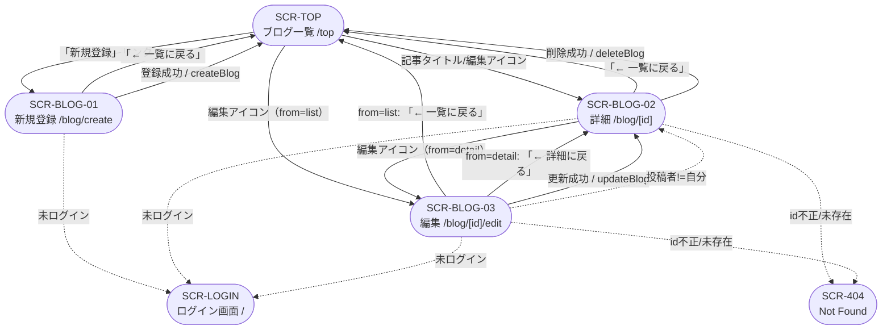
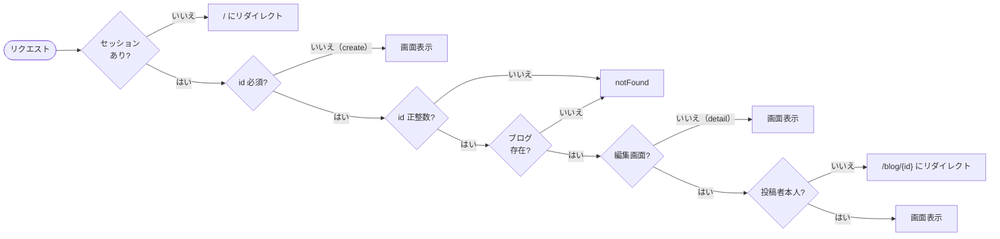

# 画面設計書（画面遷移図）

本書はブログ機能（`app/blog/` 配下）を中心とした画面遷移を示します。一覧画面 `/top` は本機能の起点／終点として扱います。

## 画面一覧

| 画面ID | 画面名 | パス |
| --- | --- | --- |
| SCR-TOP | ブログ一覧画面（本機能外、起点） | `/top` |
| SCR-BLOG-01 | ブログ新規登録画面 | `/blog/create` |
| SCR-BLOG-02 | ブログ詳細画面 | `/blog/[id]` |
| SCR-BLOG-03 | ブログ編集画面 | `/blog/[id]/edit` |
| SCR-LOGIN | ログイン画面（未ログイン時の遷移先） | `/` |
| SCR-404 | Not Found 画面（Next.js 標準） | - |

## 画面遷移図

## 遷移トリガー一覧

| 遷移元 | 遷移先 | トリガー | 種別 |
| --- | --- | --- | --- |
| SCR-TOP | SCR-BLOG-01 | 「新規登録」リンククリック | ユーザー操作 |
| SCR-TOP | SCR-BLOG-02 | 記事タイトルクリック | ユーザー操作 |
| SCR-TOP | SCR-BLOG-03 | 編集アイコン（自分の投稿）クリック → `?from=list` 付与 | ユーザー操作 |
| SCR-BLOG-01 | SCR-TOP | 「← 一覧に戻る」リンク | ユーザー操作 |
| SCR-BLOG-01 | SCR-TOP | 登録成功（`createBlog`） | サーバー処理 |
| SCR-BLOG-01 | SCR-LOGIN | 未ログインアクセス | ガード |
| SCR-BLOG-02 | SCR-TOP | 「← 一覧に戻る」リンク | ユーザー操作 |
| SCR-BLOG-02 | SCR-BLOG-03 | 編集アイコン（自分の投稿）クリック → `?from=detail` 付与 | ユーザー操作 |
| SCR-BLOG-02 | SCR-TOP | 削除確認後の削除実行（`deleteBlog`） | サーバー処理 |
| SCR-BLOG-02 | SCR-LOGIN | 未ログインアクセス | ガード |
| SCR-BLOG-02 | SCR-404 | `id` が正の整数でない / ブログ未存在 | ガード |
| SCR-BLOG-03 | SCR-TOP | `from=list` の場合「← 一覧に戻る」 | ユーザー操作 |
| SCR-BLOG-03 | SCR-BLOG-02 | `from=list` 以外の場合「← 詳細に戻る」 | ユーザー操作 |
| SCR-BLOG-03 | SCR-BLOG-02 | 更新成功（`updateBlog`） | サーバー処理 |
| SCR-BLOG-03 | SCR-BLOG-02 | 投稿者 != ログインユーザー | ガード |
| SCR-BLOG-03 | SCR-LOGIN | 未ログインアクセス | ガード |
| SCR-BLOG-03 | SCR-404 | `id` が正の整数でない / ブログ未存在 | ガード |

## クエリパラメータ仕様

### `/blog/[id]/edit?from=<list|detail>`

| 値 | 戻りリンク表示 | 戻り先 |
| --- | --- | --- |
| `list` | 「← 一覧に戻る」 | `/top` |
| `detail`（既定） | 「← 詳細に戻る」 | `/blog/{id}` |
| 未指定 / 不正値 | 「← 詳細に戻る」 | `/blog/{id}` |

※ 更新成功時の遷移先は `from` に関わらず `/blog/{id}`。

## アクセス制御フロー

## 再検証（revalidate）連動

| アクション | `revalidatePath` 対象 | 最終遷移 |
| --- | --- | --- |
| `createBlog` | `/top` | `/top` |
| `updateBlog(id)` | `/top`, `/blog/{id}` | `/blog/{id}` |
| `deleteBlog(id)` | `/top` | `/top` |
