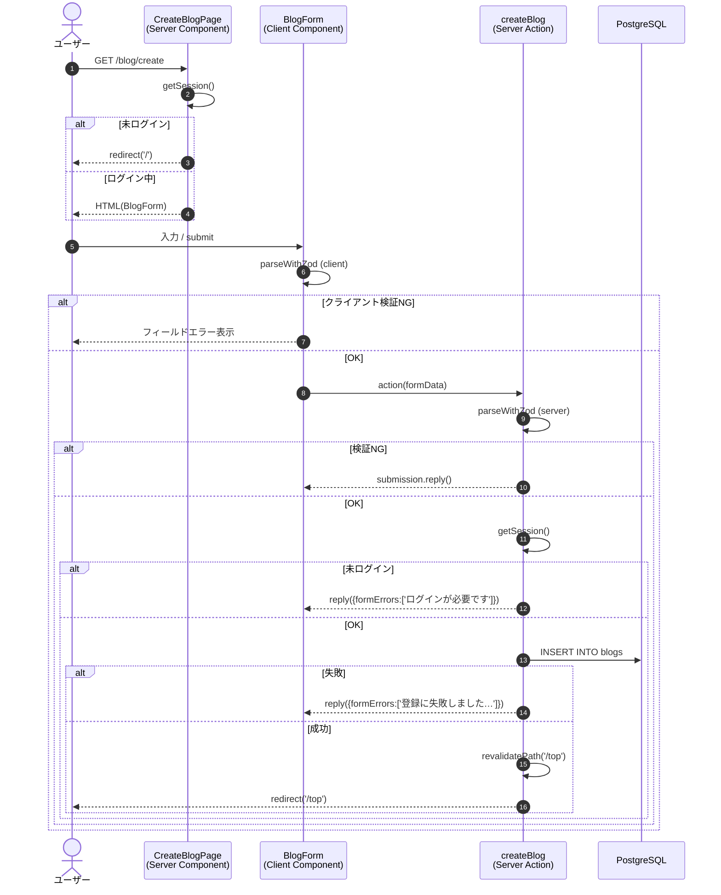

# 機能設計書：FN-BLOG-01 ブログ新規登録

## 1. 機能概要
ログイン中のユーザーがタイトルと本文を入力して新しいブログ記事を作成する機能。送信後は一覧画面（`/top`）に戻り、最新の一覧を表示する。

## 2. 関連ファイル
| 役割 | パス |
| --- | --- |
| 画面（Server Component） | `app/blog/create/page.tsx` |
| 入力フォーム（Client Component） | `app/blog/blog-form.tsx` |
| サーバーアクション | `actions/blog.ts` `createBlog` |
| バリデーションスキーマ | `actions/blog-schema.ts` `blogFormSchema` |
| 認証 | `auth.ts` |
| DB | `db/index.ts` / `db/schema.ts` `blogsTable` |

## 3. 入出力仕様

### 3.1 入力
| 項目 | 型 | 必須 | 制約 |
| --- | --- | --- | --- |
| title | string | ○ | 1〜255文字 |
| body | string | ○ | 1〜10000文字 |

### 3.2 出力（成功時）
- HTTP リダイレクト: `/top`
- DB: `blogs` テーブルに1行 INSERT
  - `title`, `body`, `user_id` は引数 / セッションから設定
  - `id`, `created_at`, `updated_at` は DB 既定値

### 3.3 出力（失敗時）
| 失敗種別 | 戻り値（`SubmissionResult`） | UI動作 |
| --- | --- | --- |
| バリデーション失敗 | `submission.reply()` | 該当フィールド下にエラー表示 |
| 未ログイン | `submission.reply({ formErrors: ['ログインが必要です'] })` | フォーム上部に表示 |
| DBエラー（例外） | `submission.reply({ formErrors: ['登録に失敗しました。時間をおいて再度お試しください'] })` | フォーム上部に表示、`console.error` に出力 |

## 4. 処理フロー

## 5. アクセス制御
| 主体 | チェック箇所 | 条件 | NG時の挙動 |
| --- | --- | --- | --- |
| ページ | `CreateBlogPage` | セッション無 | `redirect('/')` |
| アクション | `createBlog` | セッション無 | `reply({formErrors:['ログインが必要です']})` |

## 6. バリデーション
- クライアント: `useForm({ shouldValidate: 'onBlur', shouldRevalidate: 'onInput' })` で `blogFormSchema` を適用
- サーバー: `parseWithZod(formData, { schema: blogFormSchema })` を必ず実行（信頼境界）

## 7. エラー処理
- DB INSERT は `try/catch` で囲み、捕捉したエラーは `console.error('createBlog failed:', error)` で出力
- ユーザーには内部情報を出さず汎用メッセージのみ返す

## 8. キャッシュ制御
- `revalidatePath('/top')` を実行してから `redirect('/top')`
- これにより `/top` の一覧が最新になる

## 9. UI仕様（要約）
- カード形式（`Card` `size="sm"`）でフォームを表示
- 送信中はボタンを `disabled` にし、ラベルを「送信中…」へ
- ヘッダーに「← 一覧に戻る」リンク

## 10. 制約・注意事項
- `id`, `createdAt`, `updatedAt` はクライアントから受け付けない（スキーマで弾く / DB 側生成）
- 本文（`body`）は保存時にサニタイズしない（生Markdownを保存し、表示時に `react-markdown` がレンダリング）
