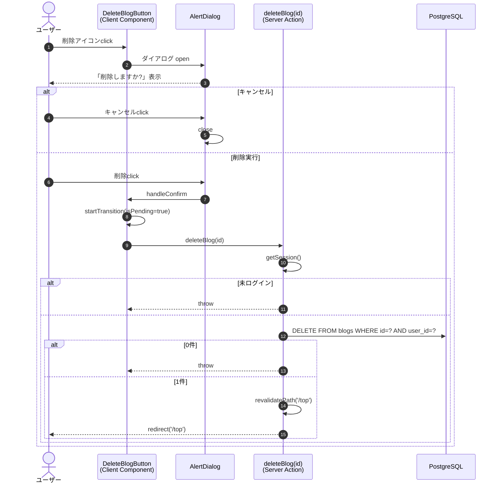

# 機能設計書：FN-BLOG-04 ブログ削除

## 1. 機能概要
ログイン中のユーザーが自身の投稿したブログを、確認ダイアログを経由して削除する機能。削除後は一覧画面（`/top`）に遷移する。

## 2. 関連ファイル
| 役割 | パス |
| --- | --- |
| トリガーUI（Client Component） | `app/blog/delete-blog-button.tsx` |
| 表示元画面 | `app/blog/[id]/page.tsx`（詳細画面） |
| サーバーアクション | `actions/blog.ts` `deleteBlog` |
| 認証 | `auth.ts` |
| ダイアログUI | `@base-ui/react/alert-dialog` |
| アイコン | `lucide-react` `Trash2` |

## 3. 入出力仕様

### 3.1 入力
| 項目 | 型 | 取得元 |
| --- | --- | --- |
| id | number | 詳細画面から props で渡される（`blog.id`） |
| title | string | ダイアログ表示用（`blog.title`） |

### 3.2 出力（成功時）
- DB: `blogs` テーブル該当行 DELETE（1行）
- リダイレクト: `/top`

### 3.3 出力（失敗時）
| 失敗種別 | 挙動 |
| --- | --- |
| 未ログイン | `throw new Error('ログインが必要です')` |
| 投稿者不一致 / 対象不在（DELETE 0件） | `throw new Error('削除権限がないか、対象が見つかりませんでした')` |
| DBエラー | 内部例外を再 throw（`console.error` に出力） |

クライアントは `useTransition` の `startTransition` 内で `await deleteBlog(id)` を呼び出す。

## 4. 処理フロー

> ※ Next.js の `redirect()` は内部的に専用例外を投げてクライアントに遷移指示を返すため、サーバーアクション側で `throw` のように見えても通常の遷移として処理される。

## 5. アクセス制御
| レイヤ | チェック | NG挙動 |
| --- | --- | --- |
| 表示 | `blog.userId === session.user.id` | 不一致なら削除ボタン自体を非表示（詳細画面側） |
| アクション | セッション有無 | `throw` |
| アクション | `WHERE id=? AND user_id=?` の戻り行数 | 0件なら `throw` |

## 6. UI仕様

### 6.1 トリガー（Trigger）
- アイコンボタン（`Trash2`）
- `variant="destructive-outline"`, `size="icon-sm"`, `aria-label="削除"`

### 6.2 ダイアログ（`AlertDialog.Popup`）
| 要素 | 表示内容 |
| --- | --- |
| Title | 「削除しますか?」 |
| Description | 「『{title}』を削除します。この操作は取り消せません。」 |
| Cancel ボタン | 「キャンセル」（`variant="outline"`） |
| Confirm ボタン | 通常「削除」、`isPending` 時「削除中…」（`variant="destructive"`） |

両ボタンとも `isPending` 中は `disabled`。

### 6.3 アニメーション
- バックドロップ: フェードイン/アウト（`data-[starting-style]:opacity-0`, `data-[ending-style]:opacity-0`）
- ポップアップ: スケール＋フェード（`data-[starting-style]:scale-95 opacity-0` ↔ 通常 `scale-100 opacity-100` ↔ `data-[ending-style]:scale-95 opacity-0`）

## 7. キャッシュ制御
- `revalidatePath('/top')` 後に `redirect('/top')`
- 詳細ページ `/blog/{id}` は対象自体が削除されるため `notFound()` で 404 となる（明示再検証不要）

## 8. エラー処理
- サーバー側: `try/catch` で `console.error('deleteBlog failed:', error)` した上で再 throw
- クライアント側: 現状 `await` の例外は捕捉していない。スローされた場合は Next.js のエラーバウンダリに伝播する

## 9. 制約・注意事項
- DELETE 文の WHERE 句に `user_id` を含めることで、他人の投稿の削除を多層的に防止
- `returning({ id })` の戻りが空配列なら「不一致 or 不在」を区別せず単一メッセージで扱う
- ダイアログのキャンセル時は何もせず閉じる（副作用なし）
- 削除アクションは `id` のみを引数とし、`FormData` を受け取らない（`useTransition` から直接呼び出し）
