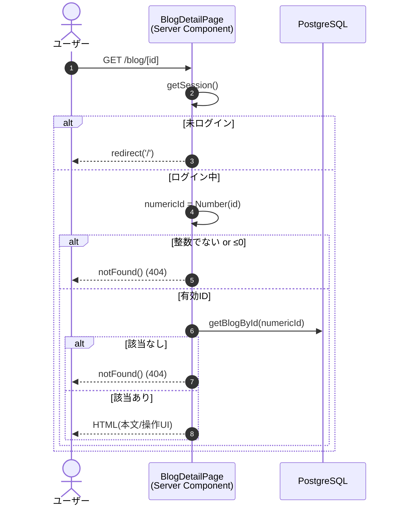

# 機能設計書：FN-BLOG-02 ブログ詳細表示

## 1. 機能概要
指定された ID のブログを取得し、タイトル・投稿者名・作成日・本文（Markdown）を表示する機能。投稿者本人の場合は編集・削除ボタンを表示する。

## 2. 関連ファイル
| 役割 | パス |
| --- | --- |
| 画面（Server Component） | `app/blog/[id]/page.tsx` |
| 削除ボタン（Client Component） | `app/blog/delete-blog-button.tsx` |
| データ取得 | `data/blogs.ts` `getBlogById` |
| 認証 | `auth.ts` |
| Markdownレンダリング | `react-markdown`, `remark-gfm` |

## 3. 入出力仕様

### 3.1 入力（URL パラメータ）
| パラメータ | 型 | 制約 |
| --- | --- | --- |
| id | string | 正の整数のみ有効、それ以外は 404 |

### 3.2 出力
| 項目 | 取得元 | 表示形式 |
| --- | --- | --- |
| タイトル | `blog.title` | `<h1>` |
| 投稿者名 | `blog.authorName` | `'不明'` フォールバック |
| 作成日 | `blog.createdAt` | `toLocaleDateString('ja-JP')` |
| 本文 | `blog.body` | `react-markdown` + `remark-gfm` |
| 編集ボタン | - | `blog.userId === session.user.id` のみ |
| 削除ボタン | - | `blog.userId === session.user.id` のみ |

### 3.3 取得クエリ（`getBlogById`）
```sql
SELECT b.id, b.title, b.body, b.user_id, b.created_at, u.name AS author_name
FROM blogs b
LEFT JOIN "user" u ON b.user_id = u.id
WHERE b.id = $1
LIMIT 1
```

## 4. 処理フロー



## 5. アクセス制御
| 状況 | 挙動 |
| --- | --- |
| 未ログイン | `redirect('/')` |
| `id` 不正 / 存在しない | `notFound()` |
| ログイン中 かつ 投稿者でない | 表示はする（編集・削除ボタン非表示） |
| ログイン中 かつ 投稿者本人 | 表示＋編集・削除ボタン表示 |

## 6. UI仕様

### 6.1 ヘッダー
- 「← 一覧に戻る」テキストリンク → `/top`

### 6.2 タイトル行（`<header>`）
- 左: タイトル（`<h1>`）
- 右: 編集アイコン（`Pencil`）と削除アイコン（`Trash2`） — 投稿者本人のみ
  - 編集アイコン → `/blog/{id}/edit?from=detail` へのリンクを `Button render={<Link/>}` で実装

### 6.3 メタ情報
`{authorName ?? '不明'} ・ {createdAt.toLocaleDateString('ja-JP')}`

### 6.4 本文
- `<article className="prose prose-neutral dark:prose-invert max-w-none">`
- Markdown: `react-markdown` に `remarkPlugins={[remarkGfm]}` を渡す

## 7. 削除ボタン連携
- 「削除アイコン」は `DeleteBlogButton` コンポーネント（詳細は FN-BLOG-04 を参照）
- `id`, `title` を props として渡す

## 8. 制約・注意事項
- `react-markdown` は標準で生 HTML を無効化（XSS 対策）。本文に `<script>` 等を埋め込んでも実行されない
- `getBlogById` は LEFT JOIN なので、投稿者ユーザーが削除済みの場合 `authorName` は `null`（UI で「不明」表示）。ただし `blogs.user_id` は ON DELETE CASCADE なので、ユーザー削除時はブログも消える
