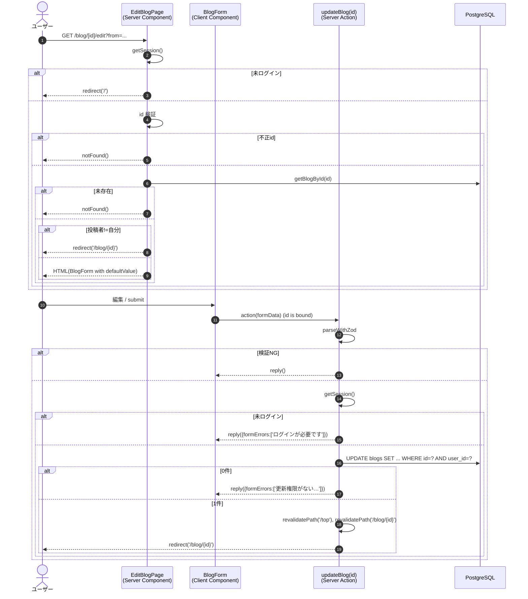

# 機能設計書：FN-BLOG-03 ブログ編集

## 1. 機能概要
ログイン中のユーザーが自身の投稿したブログ記事を編集する機能。タイトルと本文を更新し、詳細画面に戻る。

## 2. 関連ファイル
| 役割 | パス |
| --- | --- |
| 画面（Server Component） | `app/blog/[id]/edit/page.tsx` |
| 入力フォーム（Client Component） | `app/blog/blog-form.tsx` |
| サーバーアクション | `actions/blog.ts` `updateBlog` |
| バリデーションスキーマ | `actions/blog-schema.ts` `blogFormSchema` |
| データ取得 | `data/blogs.ts` `getBlogById` |
| 認証 | `auth.ts` |

## 3. 入出力仕様

### 3.1 入力
| 種別 | 項目 | 型 | 制約 |
| --- | --- | --- | --- |
| URL パラメータ | id | string | 正の整数 |
| クエリ | from | `'list' \| 'detail'` | 戻りリンク制御用、未指定/不正値は `detail` 扱い |
| フォーム | title | string | 1〜255文字 |
| フォーム | body | string | 1〜10000文字 |

### 3.2 出力（成功時）
- DB: `blogs` テーブル該当行 UPDATE（`title`, `body`、`updated_at` は `$onUpdate` で自動更新）
- リダイレクト: `/blog/{id}`

### 3.3 出力（失敗時）
| 失敗種別 | 戻り値 | UI |
| --- | --- | --- |
| バリデーション失敗 | `submission.reply()` | フィールド下にエラー |
| 未ログイン | `reply({formErrors:['ログインが必要です']})` | 上部表示 |
| 投稿者不一致 / 対象不在（UPDATE 0件） | `reply({formErrors:['更新権限がないか、対象が見つかりませんでした']})` | 上部表示 |
| DBエラー | `reply({formErrors:['更新に失敗しました。時間をおいて再度お試しください']})` | 上部表示、`console.error` |

## 4. 処理フロー

## 5. アクセス制御
| レイヤ | チェック | NG挙動 |
| --- | --- | --- |
| ページ | セッション有無 | `redirect('/')` |
| ページ | `id` 妥当性 / 存在 | `notFound()` |
| ページ | `blog.userId === session.user.id` | 不一致なら `redirect('/blog/{id}')` |
| アクション | セッション有無 | フォームエラー |
| アクション | `WHERE id=? AND user_id=?` の戻り行数 | 0件ならフォームエラー |

## 6. クエリパラメータ `from`
| `from` | 戻りリンクラベル | 戻り先 |
| --- | --- | --- |
| `list` | 「← 一覧に戻る」 | `/top` |
| `detail` / 未指定 / 不正値 | 「← 詳細に戻る」 | `/blog/{id}` |

※ 「更新」成功時のリダイレクト先は `from` に関わらず `/blog/{id}` で固定。

## 7. サーバーアクションの引数bind
クライアント側で `updateBlog.bind(null, numericId)` により `id` をバインドしてから `BlogForm` の `action` に渡す。これにより `updateBlog` の第1引数（`id`）が固定され、`useActionState` の第2/3引数（prev, formData）と整合する。

## 8. バリデーション
- クライアント / サーバー双方で `blogFormSchema` を適用
- `defaultValue` として現在の `{ title, body }` をフォームに渡す

## 9. キャッシュ制御
更新成功時に以下を再検証する。
- `/top`（一覧のタイトル変更を反映）
- `/blog/{id}`（詳細の最新内容を反映）

## 10. 制約・注意事項
- UPDATE 文の WHERE 句に `userId` を含めることで、Race condition によるセッション窃取的な操作にも対し権限漏れを防止
- `returning({ id })` の戻りが空配列なら「不一致 or 不在」として 1 メッセージで扱う（攻撃者に存在可否を漏らさない）
- `body` の Markdown 内容は更新時もサニタイズしない（詳細表示時に `react-markdown` の標準サニタイズに任せる）
