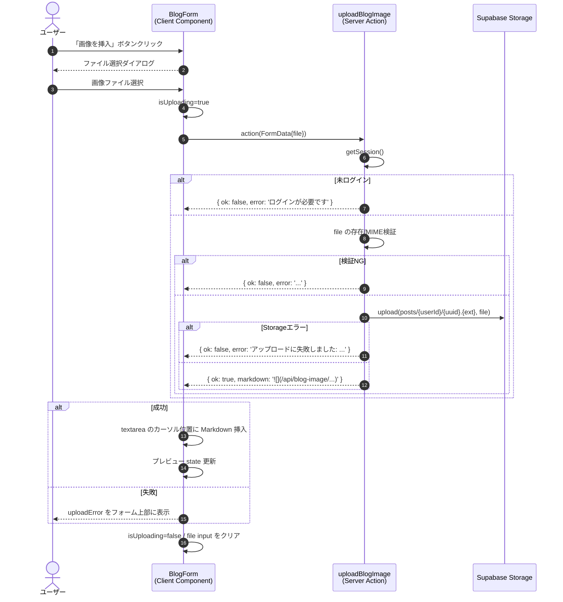
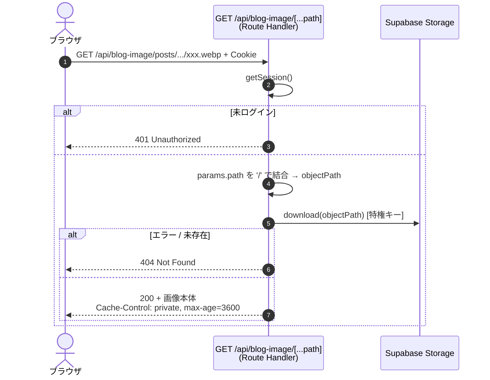

# 機能設計書：FN-BLOG-05 ブログ本文への画像挿入

## 1. 機能概要
ブログ新規登録 / 編集画面で、本文（Markdown）内に画像を挿入する機能。ユーザーがローカルから選択した画像を Supabase Storage（Private bucket）にアップロードし、本文の現在のカーソル位置に Markdown 形式（``）を挿入する。表示時は画像プロキシ Route Handler が認証チェック後にバイト列を配信する。

## 2. 関連ファイル
| 役割 | パス |
| --- | --- |
| 画像挿入UI（Client Component） | `app/blog/blog-form.tsx` |
| サーバーアクション（アップロード） | `actions/upload-image.ts` `uploadBlogImage` |
| 画像配信エンドポイント（Route Handler） | `app/api/blog-image/[...path]/route.ts` |
| Supabase Storage クライアント | `lib/supabase-storage.ts` |
| 認証 | `auth.ts` |
| 環境変数 | `.env` `SUPABASE_URL` / `SUPABASE_SECRET_KEY` |

## 3. ストレージ構成

### 3.1 バケット
| 項目 | 値 |
| --- | --- |
| バケット名 | `pictures` |
| アクセス | Private（`SUPABASE_SECRET_KEY` 経由のみアクセス可） |
| ファイルサイズ制限 | バケット作成時の設定値に従う |
| 許可 MIME types | `image/jpeg`, `image/png`, `image/webp`, `image/gif`（バケット設定 + サーバーアクション両方で検証） |
| RLS ポリシー | 未定義（特権キーが常時バイパス、DB側と同方針） |

### 3.2 オブジェクトパス規約
`posts/{userId}/{uuid}.{ext}`

| 部分 | 値 |
| --- | --- |
| `posts/` | ブログ本文用画像の固定プレフィックス |
| `{userId}` | better-auth のユーザーID（投稿者識別） |
| `{uuid}` | `crypto.randomUUID()` で生成 |
| `{ext}` | MIME type に対応する拡張子（jpg / png / webp / gif） |

## 4. 入出力仕様

### 4.1 アップロード Server Action `uploadBlogImage(formData)`

入力（`FormData`）:
| キー | 型 | 必須 | 制約 |
| --- | --- | --- | --- |
| file | File | ○ | バケット許可 MIME types のいずれか、バケット設定のサイズ上限以下 |

出力（`UploadImageResult`）:
| 状態 | 戻り値 |
| --- | --- |
| 成功 | `{ ok: true, markdown: '', path: 'posts/{userId}/{uuid}.{ext}' }` |
| 未ログイン | `{ ok: false, error: 'ログインが必要です' }` |
| ファイル未指定 / 空 | `{ ok: false, error: 'ファイルを選択してください' }` |
| 非対応 MIME type | `{ ok: false, error: '対応していない画像形式です' }` |
| Storage エラー | `{ ok: false, error: 'アップロードに失敗しました: {Supabaseのメッセージ}' }` |

### 4.2 画像配信 Route Handler `GET /api/blog-image/[...path]`

| HTTPステータス | 条件 | レスポンス |
| --- | --- | --- |
| 200 | 認証OK + ファイル存在 | 画像本体（`Content-Type: image/*`, `Cache-Control: private, max-age=3600`） |
| 401 | 未ログイン | テキスト `Unauthorized` |
| 404 | パス不正 / ファイル不存在 / Storageエラー | テキスト `Not Found` |

## 5. 処理フロー

### 5.1 アップロード〜本文挿入

### 5.2 画像配信

## 6. アクセス制御
| レイヤ | チェック | NG時の挙動 |
| --- | --- | --- |
| `uploadBlogImage` | better-auth セッション有無 | `{ ok: false, error: 'ログインが必要です' }` |
| `GET /api/blog-image/...` | better-auth セッション有無 | `401 Unauthorized` |
| Supabase Storage | RLS 未定義（特権キーが常時バイパス） | - |

- クライアントから Supabase Storage に直接アクセスする経路は存在しない。すべて Server Action / Route Handler 経由でセッション検証を通る
- `SUPABASE_SECRET_KEY` はサーバー側のみで使用（`NEXT_PUBLIC_` プレフィックス無し → クライアントバンドルに含まれない）
- DB アクセス（Drizzle + postgres スーパーユーザー直結）と同じく、「インフラ層は特権アクセス、アプリ層で better-auth が認証を担保」する構造

## 7. バリデーション

### 7.1 クライアント側（UX目的）
- `<input type="file" accept="image/jpeg,image/png,image/webp,image/gif">` でファイル選択ダイアログ段階で非対応形式を抑止

### 7.2 サーバー側（信頼境界）
- `formData.get('file')` が `File` インスタンスかつ `size > 0` であること
- MIME type が `EXT_BY_MIME` の許可リスト（jpeg/png/webp/gif）に含まれること
- ファイルサイズ：Supabase バケット設定で制限（超過時は SDK がエラー返却 → 「アップロードに失敗しました」で返す）

## 8. エラー処理
- すべての失敗パスは `{ ok: false, error: '日本語メッセージ' }` で統一
- クライアント側では `uploadError` state に格納し、本文 textarea の直上に `role="alert"` で表示
- 画像配信エラーは内容詳細を返さず `404 Not Found`（攻撃者にファイル存在情報を漏らさない）

## 9. キャッシュ制御
- ブラウザキャッシュ：`Cache-Control: private, max-age=3600`（ユーザー個別、1時間保持）
- `private` 指定により共有キャッシュ（CDN・プロキシ）には載せない
- アップロード成功時のみ本文 textarea が更新され、フォーム送信が行われるまでは DB は変更されない（既存の `createBlog` / `updateBlog` フローに影響なし）

## 10. UI仕様
- 本文エリアのヘッダー右側に「画像を挿入」ボタンを配置（`type="button"`、フォーム送信を発火させない）
- アップロード中はボタンを `disabled` にし、ラベルを「アップロード中…」に変更
- 失敗時はヘッダー直下に `role="alert"` でエラーメッセージを表示
- 挿入位置は textarea の現在のカーソル位置（`selectionStart` / `selectionEnd`）
- 挿入後はカーソルを挿入文字列の末尾に移動 + textarea にフォーカス
- file input は `hidden` 表示、ボタンクリックで `fileInputRef.current?.click()` 経由でダイアログを開く
- 同一ファイル連続選択時にも `change` イベントが発火するよう、アップロード完了後に `fileInputRef.current.value = ''` でリセット

## 11. 関連機能
- FN-BLOG-01 ブログ新規登録（`/blog/create`）
- FN-BLOG-03 ブログ編集（`/blog/[id]/edit`）

両画面で同じ `BlogForm` コンポーネントを共有するため、本機能は両画面で利用可能。

## 12. 制約・注意事項
- 画像URLは `/api/blog-image/{path}` 形式で本文 Markdown に保存される。パス規約（バケット名 `pictures` / プレフィックス `posts/` / Route Handler のパス）を変更すると過去記事の画像参照が破綻するため、互換性を維持する場合は変更不可
- ログアウト状態で画像URLにアクセスしても `401` が返るため、記事URLが外部流出しても画像は閲覧不可
- 画像ファイルの孤児（記事削除 / 編集で参照されなくなった画像）の自動削除は未実装。Storage 容量増加に注意（将来的に孤児画像のバッチ削除を検討）
- `body` の最大文字数 10,000 文字には画像URL文字列も含まれる（1URLあたり約 80〜90 文字）
- 同一ファイルを複数回アップロードしても都度新規 UUID で別パスとして保存される（重複検出・再利用は未実装）
- 画像配信時のアクセス制御は **「ログインユーザーであれば誰でも閲覧可能」**。投稿者本人のみに限定する仕様ではない
