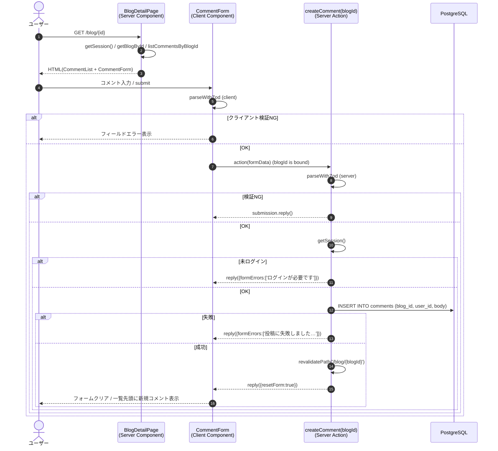

# 機能設計書：FN-CMT-01 コメント登録

## 1. 機能概要
ログイン中のユーザーが、ブログ詳細画面（SCR-BLOG-02）下部のフォームから対象ブログにコメントを投稿する機能。送信後は同じ詳細画面に留まり、新規コメントが一覧の先頭に表示される。

## 2. 関連ファイル
| 役割 | パス |
| --- | --- |
| 表示元画面（Server Component） | `app/blog/[id]/page.tsx` |
| 入力フォーム（Client Component） | `app/blog/[id]/comment-form.tsx` |
| 一覧表示（Server Component） | `app/blog/[id]/comment-list.tsx` |
| サーバーアクション | `actions/comment.ts` `createComment` |
| バリデーションスキーマ | `actions/comment-schema.ts` `commentFormSchema` |
| データ取得 | `data/comments.ts` `listCommentsByBlogId` |
| 認証 | `auth.ts` |
| DB | `db/index.ts` / `db/schema.ts` `commentsTable` |

## 3. 入出力仕様

### 3.1 入力
| 種別 | 項目 | 型 | 必須 | 制約 |
| --- | --- | --- | --- | --- |
| バインド引数 | blogId | number | ○ | 親ブログのID（クライアントから `createComment.bind(null, blogId)` で固定） |
| フォーム | body | string | ○ | 1〜1000文字 |

### 3.2 出力（成功時）
- DB: `comments` テーブルに1行 INSERT
  - `blog_id`, `user_id`, `body` をアプリ側で設定
  - `id`, `created_at`, `updated_at` は DB 既定値
- 戻り値: `submission.reply({ resetForm: true })`（フォームクリア、リダイレクトなし）
- キャッシュ: `revalidatePath('/blog/{blogId}')` で詳細画面を再検証 → コメント一覧の先頭に新規行が表示される

### 3.3 出力（失敗時）
| 失敗種別 | 戻り値（`SubmissionResult`） | UI動作 |
| --- | --- | --- |
| バリデーション失敗 | `submission.reply()` | textarea 下にエラー表示 |
| 未ログイン | `submission.reply({ formErrors: ['ログインが必要です'] })` | フォーム上部に表示 |
| DBエラー（例外） | `submission.reply({ formErrors: ['投稿に失敗しました。時間をおいて再度お試しください'] })` | フォーム上部に表示、`console.error('createComment failed:', error)` に出力 |

## 4. 処理フロー

## 5. アクセス制御
| レイヤ | チェック箇所 | 条件 | NG時の挙動 |
| --- | --- | --- | --- |
| ページ | `BlogDetailPage`（既存ガード） | セッション無 | `redirect('/')` |
| アクション | `createComment` | セッション無 | `reply({formErrors:['ログインが必要です']})` |

※ コメント投稿はログイン済み全ユーザーに許可される（記事所有者と一致している必要はない）。

## 6. サーバーアクションの引数bind
クライアント側で `createComment.bind(null, blogId)` により `blogId` をバインドしてから `CommentForm` の `action` に渡す。これにより `createComment` の第1引数（`blogId`）が固定され、`useActionState` の第2/3引数（prev, formData）と整合する。

## 7. バリデーション
- クライアント: `useForm({ shouldValidate: 'onBlur', shouldRevalidate: 'onInput' })` で `commentFormSchema` を適用
- サーバー: `parseWithZod(formData, { schema: commentFormSchema })` を必ず実行（信頼境界）

## 8. エラー処理
- DB INSERT は `try/catch` で囲み、捕捉したエラーは `console.error('createComment failed:', error)` で出力
- ユーザーには内部情報を出さず汎用メッセージのみ返す

## 9. キャッシュ制御
- `revalidatePath('/blog/{blogId}')` のみを実行（`/top` は再検証不要 — 一覧にコメント数は出さない）
- リダイレクトしないため、`useActionState` の再レンダリングで新規コメントが表示される

## 10. UI仕様（要約）
| エリア | 部品 | 内容 / 動作 |
| --- | --- | --- |
| 入力エリア | `<textarea>`（3〜5行程度） | プレースホルダー「コメントを入力…」 |
| エラー表示 | テキスト | フォーム全体エラーは上部、項目エラーは textarea 直下 |
| 送信ボタン（通常時） | テキスト「投稿する」 | `createComment` を呼び出す |
| 送信ボタン（送信中） | テキスト「送信中…」 | `disabled` |

## 11. 制約・注意事項
- 本文は **プレーンテキスト**として保存（Markdown レンダリングなし）
- 表示時は改行を保持（`white-space: pre-wrap` 相当）
- `id`, `createdAt`, `updatedAt`, `blogId`, `userId` はクライアントから受け付けない（スキーマ／bind／セッションで決まる）
- 投稿成功時はフォームをクリアするが、ページ全体の再フェッチは `revalidatePath` の効果に任せる
