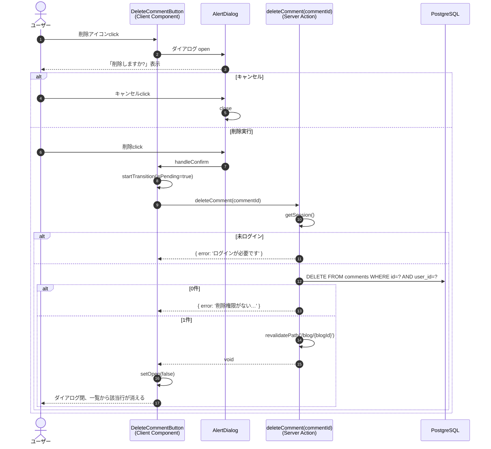

# 機能設計書：FN-CMT-03 コメント削除

## 1. 機能概要
ログイン中のユーザーが自身の投稿したコメントを、確認ダイアログを経由して削除する機能。**物理削除**を採用し、削除後はコメント一覧から該当行が消える（同画面に留まる）。

## 2. 関連ファイル
| 役割 | パス |
| --- | --- |
| トリガーUI（Client Component） | `app/blog/[id]/delete-comment-button.tsx` |
| 表示元 | `app/blog/[id]/comment-item.tsx`（一覧内の各コメント） |
| サーバーアクション | `actions/comment.ts` `deleteComment` |
| 認証 | `auth.ts` |
| ダイアログUI | `@base-ui/react/alert-dialog` |
| アイコン | `lucide-react` `Trash2` |

## 3. 入出力仕様

### 3.1 入力
| 項目 | 型 | 取得元 |
| --- | --- | --- |
| commentId | number | 一覧アイテムから props で渡される（`comment.id`） |

### 3.2 出力（成功時）
- DB: `comments` テーブル該当行 DELETE（1行、**物理削除**）
- キャッシュ: `revalidatePath('/blog/{blogId}')` で詳細画面を再検証
- UI: 同画面に留まる。再レンダリングにより一覧から該当行が消える
- 戻り値: `void`

### 3.3 出力（失敗時）
[deleteBlog](../../../actions/blog.ts) と同形の戻り値（`DeleteCommentError | void`）でクライアントに返す。

| 失敗種別 | 戻り値 | UI |
| --- | --- | --- |
| 未ログイン | `{ error: 'ログインが必要です' }` | ダイアログを閉じてエラーをトースト等で表示（実装時に判断） |
| 投稿者不一致 / 対象不在（DELETE 0件） | `{ error: '削除権限がないか、対象が見つかりませんでした' }` | 同上 |
| DBエラー | `{ error: '削除に失敗しました。時間をおいて再度お試しください' }`、`console.error('deleteComment failed:', error)` | 同上 |

※ ブログ削除は `throw` ベースだが、コメント削除はリダイレクトを伴わず同画面で完結するため、戻り値ベース（`DeleteCommentError | void`）とする。クライアントは `useTransition` でラップして呼び出す。

## 4. 処理フロー

## 5. アクセス制御
| レイヤ | チェック | NG挙動 |
| --- | --- | --- |
| 表示 | `comment.userId === session.user.id` | 不一致なら削除ボタン自体を非表示 |
| アクション | セッション有無 | エラー戻り値 |
| アクション | `WHERE id=? AND user_id=?` の戻り行数 | 0件ならエラー戻り値 |

## 6. UI仕様

### 6.1 トリガー（Trigger）
- アイコンボタン（`Trash2`）
- `variant="destructive-outline"`, `size="icon-sm"`, `aria-label="削除"`
- 投稿者本人のときのみ描画

### 6.2 ダイアログ（`AlertDialog.Popup`）
| 要素 | 表示内容 |
| --- | --- |
| Title | 「削除しますか?」 |
| Description | 「このコメントを削除します。この操作は取り消せません。」 |
| Cancel ボタン | 「キャンセル」（`variant="outline"`） |
| Confirm ボタン | 通常「削除」、`isPending` 時「削除中…」（`variant="destructive"`） |

両ボタンとも `isPending` 中は `disabled`。

### 6.3 アニメーション
[delete-blog-button.tsx](../../../app/blog/delete-blog-button.tsx) と同じ仕様を踏襲する。
- バックドロップ: フェードイン/アウト
- ポップアップ: スケール＋フェード

## 7. キャッシュ制御
- `revalidatePath('/blog/{blogId}')` を実行
- リダイレクトはしない（同画面に留まる）
- `blogId` はアクション内で SELECT して取得、もしくは `bind` の第2引数として受け取る（実装時に判断）

## 8. エラー処理
- サーバー側: `try/catch` で `console.error('deleteComment failed:', error)` した上で `{ error: '...' }` を返す
- クライアント側: 戻り値が `{ error }` 形式なら、状態 or トースト等でユーザーに通知する（実装時にUI詳細を決定）

## 9. 削除方式
**物理削除**を採用する。

| 観点 | 物理削除（採用） |
| --- | --- |
| 既存実装との一貫性 | ブログ削除（FN-BLOG-04）も物理削除 |
| CASCADE との整合 | `blogs` / `user` への FK が ON DELETE CASCADE で設計されているため、論理削除の意味が薄れる |
| 要件のシンプルさ | コメントに監査・復元・「[削除済み]」表示の要件なし |

## 10. 制約・注意事項
- DELETE 文の WHERE 句に `user_id` を含めることで、他人のコメントへの削除を多層的に防止
- `returning({ id })` の戻りが空配列なら「不一致 or 不在」を区別せず単一メッセージで扱う
- ダイアログのキャンセル時は何もせず閉じる（副作用なし）
- 削除アクションは `commentId` のみを引数とし、`FormData` を受け取らない（`useTransition` から直接呼び出し）
- ブログ削除と異なりリダイレクトは行わず、戻り値ベースのエラー伝達とする
