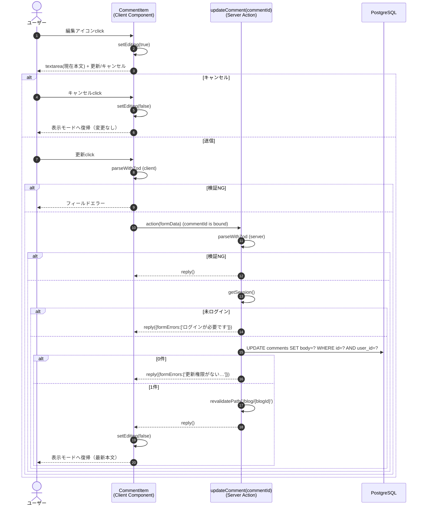

# 機能設計書：FN-CMT-02 コメント編集

## 1. 機能概要
ログイン中のユーザーが自身の投稿したコメントを **インラインで** 編集する機能。コメント一覧上の対象アイテムが入力フォームに切り替わり、更新成功後は通常表示に戻る。別画面への遷移は発生しない。

## 2. 関連ファイル
| 役割 | パス |
| --- | --- |
| 表示元画面（Server Component） | `app/blog/[id]/page.tsx` |
| 一覧表示（Server Component） | `app/blog/[id]/comment-list.tsx` |
| コメント1件（Client Component / 編集モード切替を保持） | `app/blog/[id]/comment-item.tsx` |
| サーバーアクション | `actions/comment.ts` `updateComment` |
| バリデーションスキーマ | `actions/comment-schema.ts` `commentFormSchema` |
| 認証 | `auth.ts` |

## 3. 入出力仕様

### 3.1 入力
| 種別 | 項目 | 型 | 必須 | 制約 |
| --- | --- | --- | --- | --- |
| バインド引数 | commentId | number | ○ | 対象コメントのID（`updateComment.bind(null, commentId)` で固定） |
| フォーム | body | string | ○ | 1〜1000文字（登録と同一スキーマ） |

### 3.2 出力（成功時）
- DB: `comments` テーブル該当行 UPDATE
  - `body` を更新、`updated_at` は `$onUpdate` により自動更新
- 戻り値: `submission.reply()`（フォームを閉じて表示モードへ戻すための合図）
- キャッシュ: `revalidatePath('/blog/{blogId}')` で詳細画面を再検証
- UI: 編集モード解除、最新本文が表示モードでレンダリングされる

### 3.3 出力（失敗時）
| 失敗種別 | 戻り値 | UI |
| --- | --- | --- |
| バリデーション失敗 | `submission.reply()` | textarea 直下にエラー表示（編集モードは維持） |
| 未ログイン | `reply({formErrors:['ログインが必要です']})` | 編集フォーム上部に表示 |
| 投稿者不一致 / 対象不在（UPDATE 0件） | `reply({formErrors:['更新権限がないか、対象が見つかりませんでした']})` | 編集フォーム上部に表示 |
| DBエラー | `reply({formErrors:['更新に失敗しました。時間をおいて再度お試しください']})` | 編集フォーム上部に表示、`console.error('updateComment failed:', error)` |

## 4. 処理フロー

## 5. アクセス制御
| レイヤ | チェック | NG挙動 |
| --- | --- | --- |
| 表示 | `comment.userId === session.user.id` | 不一致なら編集アイコン自体を非表示 |
| アクション | セッション有無 | フォームエラー |
| アクション | `WHERE id=? AND user_id=?` の戻り行数 | 0件ならフォームエラー |

## 6. インライン編集の状態管理

`CommentItem` がローカルに `editing` 状態を持つ（`useState<boolean>`）。

| 状態 | 表示内容 |
| --- | --- |
| `editing = false`（既定） | 本文表示 + 編集／削除アイコン（投稿者本人のみ） |
| `editing = true` | textarea（現在本文を初期値） + 更新ボタン + キャンセルボタン |

- 編集モードへの切り替えは表示モード側の編集アイコンクリックで `setEditing(true)`
- 編集モードからの離脱は以下のいずれか:
  - キャンセルボタンクリック → `setEditing(false)`（フォーム破棄）
  - 更新成功 → アクション戻り後に `setEditing(false)`

## 7. サーバーアクションの引数bind
クライアント側で `updateComment.bind(null, commentId)` により `commentId` をバインドしてから `<form action={...}>` に渡す。`blogId` はアクション内部で SELECT して取得し `revalidatePath` に使う、もしくは `bind` の第2引数として渡してもよい（実装時に判断）。

## 8. バリデーション
- クライアント / サーバー双方で `commentFormSchema` を適用
- `defaultValue` として現在の `{ body }` をフォームに渡す
- 入力中は textarea 内のみで完結（他のコメント表示には影響しない）

## 9. キャッシュ制御
- 更新成功時に `revalidatePath('/blog/{blogId}')` を実行
- リダイレクトはしない（同画面に留まる）
- 一覧の並び順は `created_at` DESC なので、編集による位置変動は発生しない

## 10. UI仕様（要約）
### 10.1 編集モードのフォーム
| エリア | 部品 | 内容 |
| --- | --- | --- |
| 入力欄 | `<textarea>` | 現在本文を初期値 |
| エラー表示 | テキスト | フォーム全体エラーは上部、項目エラーは textarea 直下 |
| 更新ボタン（通常時） | テキスト「更新」 | `updateComment` を呼び出す |
| 更新ボタン（送信中） | テキスト「更新中…」 | `disabled` |
| キャンセルボタン | テキスト「キャンセル」 | `setEditing(false)`、サーバーには到達しない |

### 10.2 並び順への影響
- 編集による `updated_at` 更新では一覧の並びは変わらない（`ORDER BY created_at DESC`）

### 10.3 「(編集済み)」表示
- 各コメント表示モードのメタ情報行（著者名 + 投稿日時の隣）に「(編集済み)」を表示
- 判定: `comment.updatedAt.getTime() !== comment.createdAt.getTime()`
  - INSERT 時は両カラムとも PostgreSQL の `now()` 既定値で同一値
  - UPDATE 時のみ `$onUpdate` により `updatedAt` が更新され値が変わる
- スタイル: `text-xs text-muted-foreground`（投稿日時と同階層）

## 11. 制約・注意事項
- UPDATE 文の WHERE 句に `user_id` を含めることで、他人のコメントへの上書きを多層的に防止
- `returning({ id })` の戻りが空配列なら「不一致 or 不在」として 1 メッセージで扱う（攻撃者に存在可否を漏らさない）
- 編集中に同一コメントを別タブで削除した場合は「更新権限がないか、対象が見つかりませんでした」が返る
